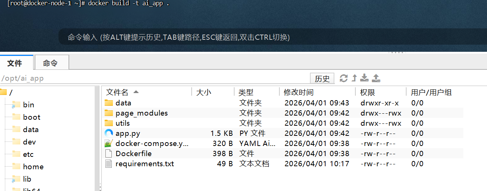

# AI 应用平台

一个基于 Streamlit + SQLite + Ollama 的轻量级 AI 对话应用，支持用户注册、登录、聊天记录持久化及流式输出。

## 功能特性

- 用户注册 / 登录（密码哈希存储）
- 支持多模型选择（qwen2.5:0.5b / deepseek-r1:1.5b）
- 流式对话输出（打字机效果）
- 聊天记录自动保存至数据库
- 历史记录查询与导出功能

## 快速开始

### 一、服务器要求

- 操作系统：Linux（Ubuntu 20.04/22.04 或 CentOS 7+）
- 配置：最低 2核 4GB 内存
- 已安装 Docker 与 Docker Compose

### 二、部署步骤

1. **克隆项目到服务器**

```bash
git clone https://gitee.com/qiu-begin/python-ai-learning.git
cd python-ai-learning/employment/projects/ai_app_with_db
```

2. **准备依赖文件**

确保目录下包含以下文件（已放置于 `docker` 目录中）：

- `requirements.txt`
- `Dockerfile`
- `docker-compose.yml`

3. **构建镜像并启动服务**

```bash
docker build -t ai_app .
docker-compose up -d
```



4. **下载模型（首次启动后执行）**

```bash
docker exec ollama ollama pull deepseek-r1:1.5b
docker exec ollama ollama pull qwen2.5:0.5b
```

5. **修改前端模型选项（可选）**

编辑 `page_modules/chat.py`，将模型列表改为实际可用模型：

```python
model_name = st.selectbox("选择模型", ["deepseek-r1:1.5b", "qwen2.5:0.5b"], index=0)
```

也可通过命令直接修改：

```bash
docker exec ai_app sed -i 's/model_name = st.selectbox("选择模型", \["qwen2.5:0.5b", "qwen2.5:7b", "qwen3.5:9b"\], index=0)/model_name = st.selectbox("选择模型", ["deepseek-r1:1.5b", "qwen2.5:0.5b"], index=0)/' /app/page_modules/chat.py
docker exec ai_app cat /app/page_modules/chat.py | grep "selectbox"
docker restart ai_app
```

6. **重启应用**

```bash
docker-compose restart ai-app
```

7. **查看运行状态**

```bash
docker-compose logs -f ai-app
```

### 三、访问应用

浏览器访问：`http://你的服务器IP:8501`

### 四、数据持久化

- 数据库文件：`./data/app.db`
- Ollama 模型：`./ollama_data/`

### 五、常用维护命令

| 命令 | 说明 |
|------|------|
| `docker-compose up -d` | 启动所有服务 |
| `docker-compose down` | 停止并删除容器 |
| `docker-compose restart ai-app` | 仅重启 AI 应用 |
| `docker-compose logs -f` | 查看实时日志 |
| `docker exec ollama ollama list` | 查看已下载的模型 |

### 六、注意事项

- 模型名称需与服务器实际模型一致，可通过 `docker exec ollama ollama list` 查看
- 首次启动需下载模型（约 500MB），请耐心等待
- 4GB 内存服务器建议仅运行 1.5B 模型，避免内存不足

### 七、故障排查

| 现象 | 可能原因 | 解决方法 |
|------|---------|---------|
| 页面空白 | 依赖未安装 | 检查 `docker-compose logs ai-app` |
| 聊天无响应 | 模型未下载 | 执行 `docker exec ollama ollama pull deepseek-r1:1.5b` |
| 连接 Ollama 失败 | 网络不通 | 检查 `docker-compose logs ollama` |

## 在线体验

- 部署地址：[http://120.78.72.2:8501](http://120.78.72.2:8501)
- 可直接注册体验，模型基于本地 Ollama（deepseek-r1:1.5b / qwen2.5:0.5b）